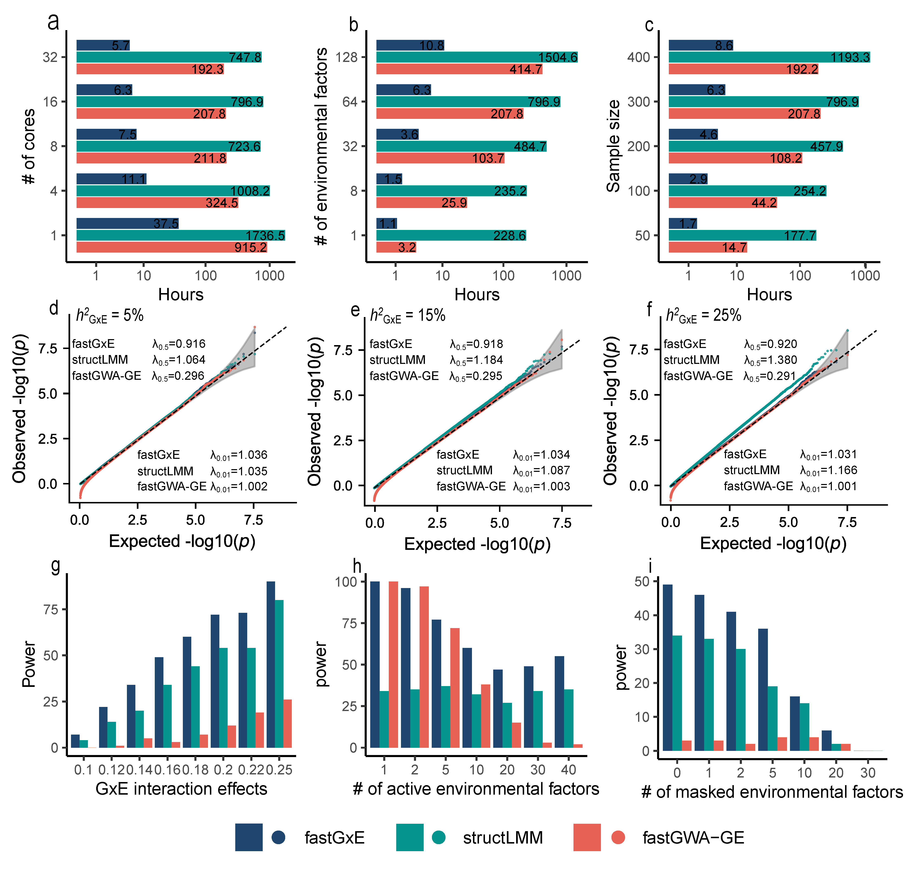

We present fastGxE, a scalable and effective genome-wide multi-environment GxE method designed to identify genetic variants that interact with one or multiple environmental factors. fastGxE controls for both polygenic effects and polygenic interaction effects, is robust to the number of environmental factors contributing to GxE interactions, and ensures scalability for genome-wide analysis in large biobank studies, achieving speed improvements of 32.98-126.49 times over existing approaches. We also developed mmSuSiE, an extension of SuSiE specifically designed for mixed-model analysis, to identify the environmental factors driving the detected GxE interactions by fastGxE. We illustrate the benefits of fastGxE through extensive simulations and an in-depth analysis of 32 physical traits and 67 blood biomarkers from the UK Biobank. In real data applications, fastGxE identifies nine genomic loci associated with physical traits, including six novel ones, and 26 genomic loci associated with blood biomarkers, 19 of which are novel. Example of interactions include *CHRNA5-A3-B4* interacting with smoking status, time spent watching television and water intake to influence FEV1/FVC ratio (FFR), *FBXO32* interacting with age to influence pulse pressure, and *ARHGEF3* interacting with age, time spent watching television and water intake to be associated with platelet distribution width. These new discoveries highlight the dynamic interplay between genetics and the environment, uncovering potentially clinically significant pathways that could inform personalized interventions and treatment strategies.

​                                                                    **Runtime and simulation comparisons of fastGxE, structLMM, and fastGWA-GE**

Cite `fastGxE`
-------------------
Chao Ning, Xiang Zhou#, fastGxE: Powering genome-wide detection of genotype-environment interactions in biobank studies, 2025

Contact
-------------------
if you have questions, feel free to leave messages on the [github issues](https://github.com/chaoning/fastGxE/issues) or contact me through email: ningchao91@gmail.com

Our group
-------------------
[Xiang Zhou Lab Website](https://xiangzhou.github.io/)

