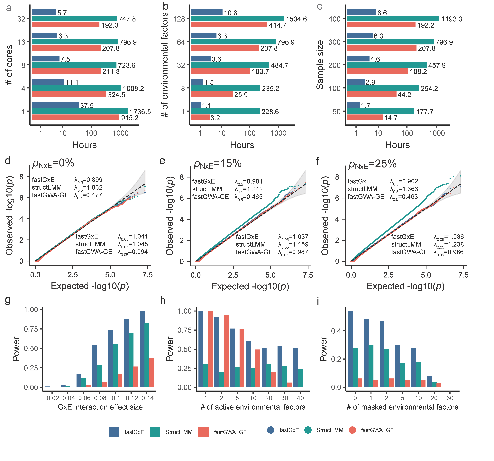

Traditional genome-wide association studies (GWAS) have primarily focused on detecting main genotype effects, often overlooking genotype-environment interactions (GxE), which are essential for understanding context-specific genetic effects and refining disease etiology. Here, we present fastGxE, a scalable and effective genome-wide GxE method designed to identify genetic variants that interact with environmental factors to influence traits of interest. fastGxE controls for polygenic effects, polygenic interaction effects, and noise heterogeneity; it remains robust to the number of environmental factors involved in GxE interactions; and it ensures scalability for genome-wide GxE analysis in large biobank studies, achieving speed improvements of 32.98-126.49 times over existing approaches. We illustrate the benefits of fastGxE through extensive simulations and an in-depth analysis of 32 physical traits and 67 blood biomarkers from the UK Biobank. In real data applications, fastGxE identifies nine genomic loci associated with physical traits, including six novel ones, and 25 genomic loci associated with blood biomarkers, 18 of which are novel. The new discoveries highlight the dynamic interplay between genetics and the environment, uncovering potentially clinically significant pathways that could inform personalized interventions and treatment strategies.

​                                                                    **Runtime and simulation comparisons of fastGxE, structLMM, and fastGWA-GE**

Cite `fastGxE`
-------------------
Chao Ning, Xiang Zhou#, fastGxE: Powering genome-wide detection of genotype-environment interactions in biobank studies, 2025

Contact
-------------------
if you have questions, feel free to leave messages on the [github issues](https://github.com/chaoning/fastGxE/issues) or contact me through email: ningchao91@gmail.com

Our group
-------------------
[Xiang Zhou Lab Website](https://xiangzhou.github.io/)

