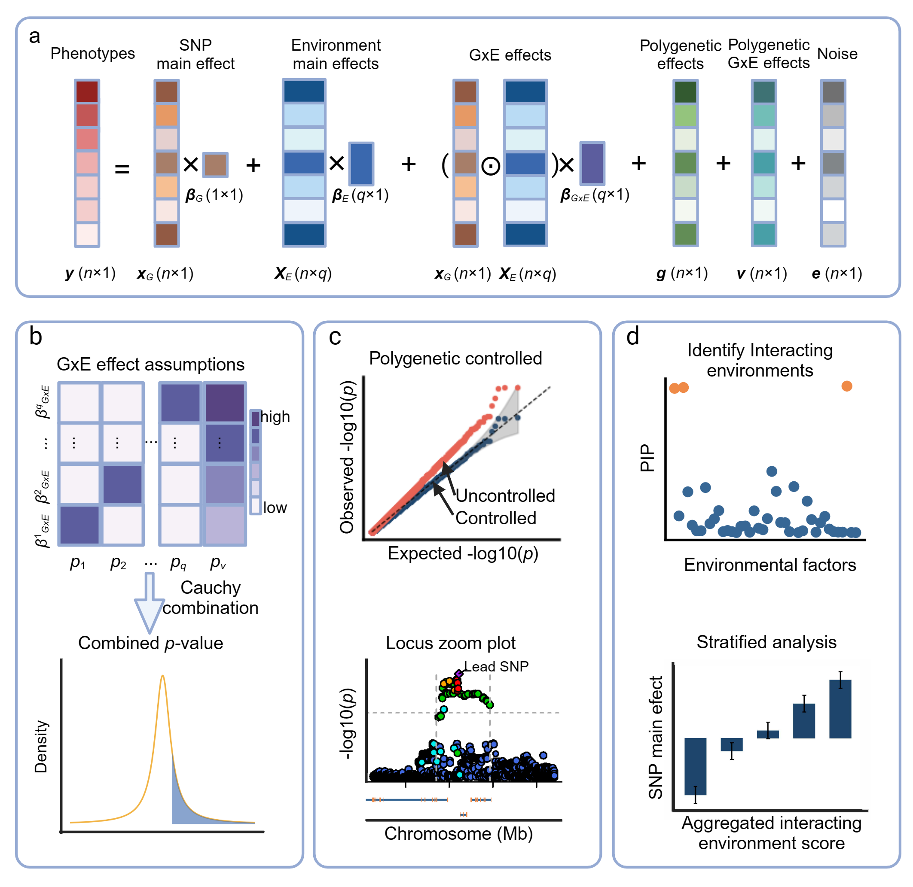

## fastGxE Overview

fastGxE is a scalable and effective method designed for genome-wide GxE association analysis. fastGxE handles multiple environmental factors and examines one SNP at a time, decomposing the phenotype into SNP main effect, environmental main effects, GxE interaction effects, while controlling for both polygenic effects and polygenic interaction effects (a). fastGxE evaluates various GxE effect size configurations and combine the resulting p-values into a single p-value to test whether the SNP interacts with at least one environmental factor (b). With controlled polygenic and polygenic interaction effects, fastGxE generates calibrated p-values for identifying candidate GxE loci (c). Additionally, it utilizes mmSuSiE, an extension of the SuSiE algorithm, to identify the environmental factors driving the detected GxE interactions and employs the stratified Wald test to validate and visualize these interactions (d). fastGxE is implemented as an open-source C++ package, freely available at [[Software - Xiang Zhou Lab Website](https://xiangzhou.github.io/software/)]([Software - Xiang Zhou Lab Website](https://xiangzhou.github.io/software/)). 

## User's Guide with fastGxE: [here]([Tutorial](http://www.chaoning.org/fastGxE/documentation/04_Tutorial.html)).
